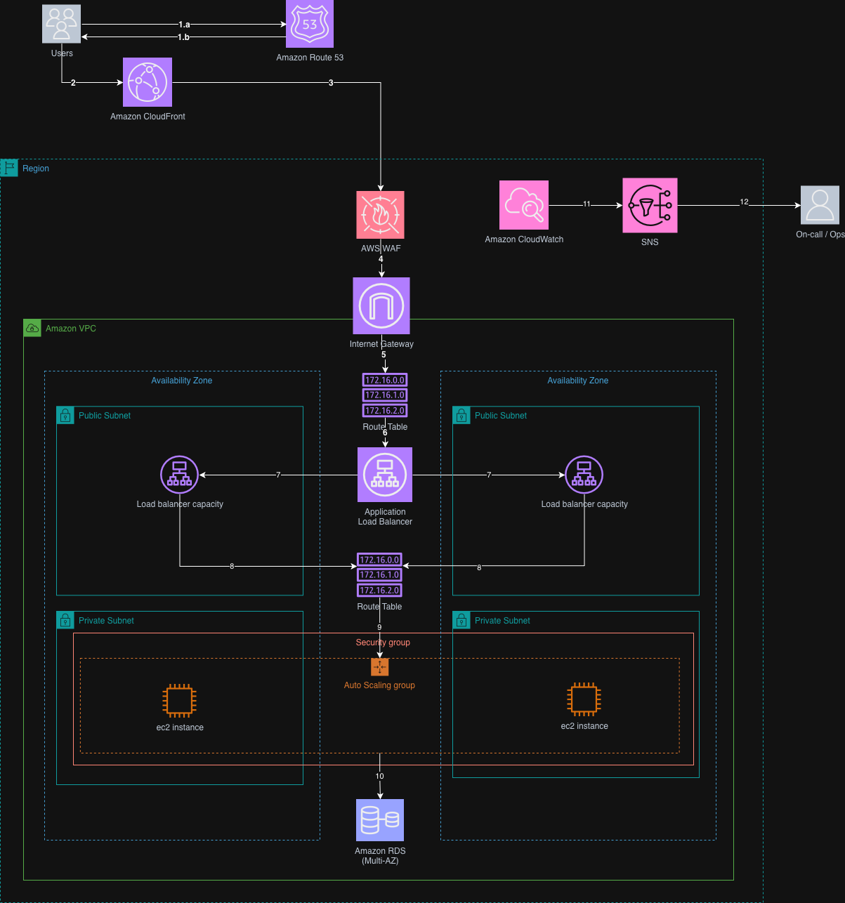
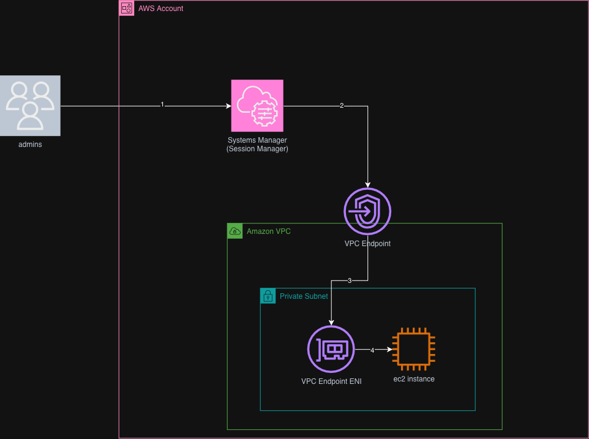

# Scalable Web Application with ALB and Auto Scaling

A production-grade, highly available web application on AWS, built on EC2 inside a segmented VPC across two Availability Zones. The system is documented as **two complementary architecture diagrams**, each covering a distinct access path into the environment:

1. **[Client → Application flow](#diagram-1--client-to-application-architecture)** — how end users reach the application, and how operators are notified if something breaks.
2. **[Admin → EC2 via Systems Manager](#diagram-2--secure-instance-access-via-systems-manager)** — how administrators reach EC2 instances for management, without SSH keys, bastion hosts, or public exposure.

Together they cover the full lifecycle of the system: serving traffic, scaling, monitoring, and operating it securely.

---

## Table of Contents

- [Diagram 1 — Client-to-Application Architecture](#diagram-1--client-to-application-architecture)
  - [Step-by-step flow](#diagram-1-step-by-step-flow)
  - [Design justification](#diagram-1-design-justification)
- [Diagram 2 — Secure Instance Access via Systems Manager](#diagram-2--secure-instance-access-via-systems-manager)
  - [Step-by-step flow](#diagram-2-step-by-step-flow)
  - [Design justification](#diagram-2-design-justification)
- [How the two diagrams fit together](#how-the-two-diagrams-fit-together)
- [Mapping to the original task requirements](#mapping-to-the-original-task-requirements)
- [Repository structure](#repository-structure)

---

## Diagram 1 — Client-to-Application Architecture



This diagram shows the complete path a user's request takes to reach the application, and the parallel path an operational alert takes to reach an on-call engineer if something goes wrong. It spans DNS resolution, edge caching, perimeter security, load balancing, compute scaling, the database tier, and monitoring/alerting — end to end.

### Diagram 1: Step-by-step flow

| Step | From → To | What happens |
|---|---|---|
| **1a / 1b** | Users ↔ Amazon Route 53 | The user's client resolves the application's domain name. Route 53 returns the DNS answer (an alias pointing at the CloudFront distribution). This is a request/response pair, hence the bidirectional numbering. |
| **2** | Users → Amazon CloudFront | The client sends the actual HTTP(S) request to the resolved CloudFront endpoint, the nearest edge location. |
| **3** | CloudFront → AWS WAF | For requests that are not served from CloudFront's cache (dynamic content, or a cache miss), CloudFront forwards the request toward the origin. Before it reaches that origin, it passes through AWS WAF for inspection. |
| **4** | AWS WAF → Internet Gateway | WAF evaluates the request against its managed rule groups (OWASP Top 10, rate-based rules). Requests that pass inspection continue into the VPC through the Internet Gateway. |
| **5** | Internet Gateway → Route Table (public) | The Internet Gateway hands the packet to the VPC's public route table, which knows how to route traffic destined for the public subnets in each Availability Zone. |
| **6** | Route Table → Application Load Balancer | The route table directs traffic to the ALB, which has nodes in the public subnet of each AZ. |
| **7** | ALB → Load balancer capacity (per AZ) | The ALB distributes incoming connections across its load-balancer nodes/capacity provisioned in each public subnet, one per Availability Zone, for high availability. |
| **8** | Load balancer capacity → Route Table (private-side) | Each AZ's load-balancer capacity forwards the request into the private-side route table, which routes traffic on to the application tier. |
| **9** | Route Table → Security Group → Auto Scaling Group | Traffic passes through the security group attached to the compute tier (allowing only ALB-sourced traffic on the application port) before reaching the Auto Scaling Group's EC2 instances, which are spread across private subnets in both AZs. |
| **10** | Auto Scaling Group (EC2) → Amazon RDS (Multi-AZ) | The application running on the EC2 instances reads and writes to the Multi-AZ RDS database, which sits in its own private subnet tier and replicates synchronously to a standby in the second AZ. |
| **11** | Amazon CloudWatch → Amazon SNS | In parallel with request handling, CloudWatch continuously evaluates metrics/alarms from the ALB, ASG, EC2, and RDS. When an alarm's threshold is breached, CloudWatch publishes a notification to an SNS topic. |
| **12** | Amazon SNS → On-call / Ops | SNS fans the alert out to its subscribers — email, SMS, or a chat-ops integration — so an on-call engineer is notified without needing to actively watch a dashboard. |

### Diagram 1: Design justification

**Why Route 53 + CloudFront in front of the ALB, rather than the ALB directly:**
Route 53 gives the application a stable, human-readable domain with the flexibility to repoint or add health-check-based failover later without asking users to change anything. CloudFront caches static assets at edge locations close to users, which reduces latency for anything cacheable and reduces the number of requests that ever reach the ALB and EC2 fleet — directly supporting the "reduce latency" and "cache static assets" requirement.

**Why WAF sits between CloudFront and the Internet Gateway:**
Placing WAF here means every request that reaches the VPC — cached-miss traffic from CloudFront included — is inspected against OWASP Top 10 managed rule groups before it can reach the load balancer or compute tier. This satisfies the requirement to defend against common web exploits (SQL injection, XSS, bad bots) at the perimeter, before they ever reach application code.

**Why two Availability Zones, each with a public and private subnet:**
The task calls for high availability, which by definition requires tolerance to the loss of a single AZ. Duplicating the ALB's load-balancer capacity, the Auto Scaling Group's EC2 instances, and the RDS standby across two AZs means no single AZ failure takes the application down. Public subnets are reserved for internet-facing components (ALB); the compute and database tiers stay in private subnets with no direct internet exposure.

**Why route tables appear explicitly on both the public and private side:**
The diagram calls out the route table twice deliberately: once directing external traffic from the Internet Gateway to the ALB (public route table, with a default route to the IGW), and once directing traffic from the load balancer onward to the compute tier (private route table, with a default route to a NAT Gateway for any outbound needs). This makes explicit that public and private subnets are governed by separate route tables — a core VPC design requirement — rather than leaving routing implicit.

**Why a security group sits between the route table and the Auto Scaling Group:**
This enforces least privilege at the instance level: only traffic originating from the ALB's security group, on the application port, is permitted to reach the EC2 instances. Even if a request reached the private subnet by some other means, the security group would still block it. This is the second layer of the defense-in-depth model (network segmentation being the first).

**Why the Auto Scaling Group spans both private subnets:**
Distributing EC2 instances across both AZs — combined with a target tracking scaling policy — means the application both survives an AZ outage and automatically adjusts capacity to match real demand, addressing the "highly available" and "scalable" requirements together rather than treating them as separate concerns.

**Why RDS is Multi-AZ:**
A single-AZ database would undermine every other high-availability decision in this design — the compute tier could survive an AZ loss, but the application would still go down if its database didn't. Multi-AZ RDS provides a synchronously replicated standby and automated failover, so a database-tier AZ failure does not require manual intervention.

**Why CloudWatch and SNS run in parallel to the request path rather than being visited on the way through:**
Monitoring must observe the system, not sit in the request's critical path — inserting it inline would add latency and a new failure mode to every request. Instead, CloudWatch pulls metrics from the ALB, ASG, EC2, and RDS continuously, and only when an alarm actually fires does it push an event to SNS and on to the on-call engineer. This keeps user-facing latency unaffected while still providing operational visibility.

---

## Diagram 2 — Secure Instance Access via Systems Manager



This diagram documents how administrators access EC2 instances that live entirely in private subnets, with no public IP addresses, no open inbound SSH ports, and no bastion host — directly satisfying the "Systems Manager as a bastion-free access alternative" learning outcome.

### Diagram 2: Step-by-step flow

| Step | From → To | What happens |
|---|---|---|
| **1** | Admins → Systems Manager (Session Manager) | An administrator authenticates with their IAM identity and starts a session through AWS Systems Manager's Session Manager capability — no SSH key, no bastion host, and no inbound port opened on the instance. |
| **2** | Systems Manager → VPC Endpoint | The Session Manager service reaches into the target VPC through an interface **VPC Endpoint** for Systems Manager (AWS PrivateLink), rather than routing over the public internet. |
| **3** | VPC Endpoint → VPC Endpoint ENI (in the private subnet) | The VPC Endpoint is backed by an Elastic Network Interface (ENI) placed directly inside the private subnet, giving Systems Manager a private, in-VPC path to reach instances that have no route to the internet at all. |
| **4** | VPC Endpoint ENI → EC2 instance | The SSM Agent running on the EC2 instance establishes the session through this private path, giving the administrator an interactive shell on the instance. |

### Diagram 2: Design justification

**Why Systems Manager Session Manager instead of a bastion host:**
A bastion host is itself a standing, internet-facing attack surface: it needs a public IP, an open SSH port, and a fleet of SSH keys to manage and rotate. Session Manager removes all of that — access is governed entirely by IAM policy, requires no long-lived credentials on the client side, and every session is logged (optionally to CloudWatch Logs or S3) for auditability. This directly satisfies the requirement to use Systems Manager as a bastion-free access alternative.

**Why a VPC Endpoint rather than routing through a NAT Gateway or the internet:**
The EC2 instances in this architecture sit in private subnets that may have no outbound internet path at all, or may be intentionally restricted from one. Using an interface VPC Endpoint for Systems Manager (backed by AWS PrivateLink) means the Session Manager traffic never leaves the AWS network — it travels over a private ENI placed inside the same private subnet as the instances, rather than depending on internet egress. This keeps the instance genuinely isolated from the public internet while still remaining fully manageable.

**Why this is shown as a separate diagram from the client-to-application flow:**
Client traffic and administrative access are fundamentally different trust boundaries with different entry points, different protocols, and different security controls (WAF/ALB for the former, IAM/PrivateLink for the latter). Documenting them separately keeps each diagram legible and makes it possible to reason about — and audit — each access path independently, rather than overloading a single diagram with two unrelated flows.

**Why this matters for the overall security posture:**
Between the two diagrams, there is no path into the EC2 fleet that does not pass through either (a) WAF + ALB for application traffic, or (b) IAM + Session Manager + PrivateLink for administrative access. No SSH keys exist anywhere in the design, and no instance has a public IP. This is the practical implementation of the "secure applications with WAF, Security Groups, and private subnets" and "bastion-free access" learning outcomes.

---

## How the two diagrams fit together

| Concern | Diagram 1 (Client → App) | Diagram 2 (Admin → EC2) |
|---|---|---|
| Entry point | Public internet, via Route 53/CloudFront | AWS Management Console / CLI, via IAM |
| Perimeter control | AWS WAF | IAM policy (no network perimeter to cross — traffic never touches the public internet) |
| Path into the VPC | Internet Gateway | VPC Endpoint (AWS PrivateLink) |
| Reaches | Auto Scaling Group behind the ALB | Specific EC2 instance(s) directly |
| Protocol | HTTP/HTTPS | Encrypted Session Manager channel |
| Auditable via | ALB access logs, WAF logs | Session Manager session logs |

Both diagrams describe access into the **same underlying VPC and EC2 fleet** — they are two different doors into one house, each hardened for its specific purpose.

## Mapping to the original task requirements

| Requirement | Where it's addressed |
|---|---|
| VPC with public/private subnets, NAT Gateway, Security Groups, NACLs | Diagram 1 — public/private route tables, security group before the ASG |
| EC2 + ASG with target tracking scaling | Diagram 1, steps 6–9 |
| ALB + WAF, Layer 7 routing, OWASP Top 10 | Diagram 1, steps 3–7 |
| CloudFront caching static assets | Diagram 1, step 2–3 |
| RDS Multi-AZ with automated failover | Diagram 1, step 10 |
| Route 53 alias record + health checks | Diagram 1, steps 1a/1b |
| Systems Manager Session Manager, bastion-free access | Diagram 2, all steps |
| CloudWatch + SNS dashboards, alarms, notifications | Diagram 1, steps 11–12 |

## Repository structure

```
.
├── README.md
└── docs/
    └── images/
        ├── client-to-application.png       # Diagram 1
        └── session-manager-access.png      # Diagram 2
```
